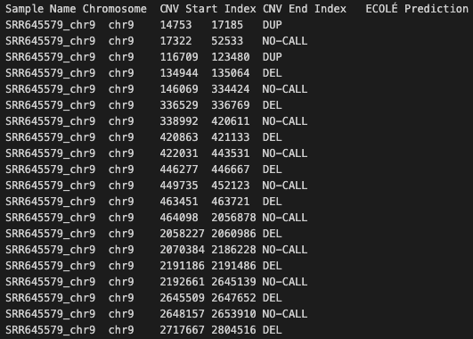

# ECOLÉ: Learning to call copy number variants on whole exome sequencing data


> ECOLÉ is a deep learning based software that performs CNV call predictions on WES data using read depth sequences.

> <a href="https://en.wikipedia.org/wiki/Deep_learning" target="_blank">**Deep Learning**</a>, <a href="https://en.wikipedia.org/wiki/Copy-number_variation" target="_blank">**Copy Number Variation**</a>, <a href="https://en.wikipedia.org/wiki/Exome_sequencing" target="_blank">**Whole Exome Sequencing**</a>


---

## Authors

Berk Mandiracioglu, Furkan Ozden, Can Alkan, A. Ercument Cicek

---

## Questions & comments 

[firstauthorname].[firstauthorsurname]@epfl.ch

---


## Table of Contents 

> Warning: Please note that ECOLÉ software is completely free for academic usage. However it is licenced for commercial usage. Please first refer to the [License](#license) section for more info.

- [Installation](#installation)
- [Features](#features)
- [Instructions Manual](#instructions-manual)
- [Usage Examples](#usage-examples)
- [Citations](#citations)
- [License](#license)


---

## Installation

- ECOLÉ is a python3 script and it is easy to run after the required oackages are installed.

### Requirements

For easy requirement handling, you can use ECOLE_environment.yml files to initialize conda environment with requirements installed:

```shell
$ conda env create --name ecole_env -f ECOLE_environment.yml
$ conda activate ecole_env
```

---

## Features

- ECOLÉ provides GPU support optionally. See [GPU Support](#gpu-support) section.


## Instructions Manual
Important notice: Please call the ECOLÉ_call.py script from the scripts directory.

### Required Arguments

#### -m, --model
- Pretrained models of the paper, one of the following: (1) ecole, (2) ecole-ft-expert, (3) ecole-ft-somatic. 
- Input data path obtained comprised of WES samples with read depth data.
- If you want to use custom model weights for ECOLÉ obtained using ECOLÉ_train.py script.

#### -bs, --batch_size
- Batch size to be used to perform CNV call on the samples. 

#### -i, --input
- Relative or direct path for are the processed WES samples, including read depth data. 

#### -o, --output
- Relative or direct output directory path to write ECOLÉ output file.

### -c, --cnv
- Level of resolution you desire, choose one of the options: (1) exonlevel, (2) merged.


### -n, --normalize
- Relative or direct path for mean&std stats of read depth values to normalize. These values are obtained precalculated from the training dataset before the pretraining.


### Optional Arguments

#### -g, --gpu
- Set to PCI BUS ID of the gpu in your system.
- You can check, PCI BUS IDs of the gpus in your system with various ways. Using gpustat tool check IDs of the gpus in your system like below:

#### -v, --version
-Check the version of ECOLÉ.

#### -h, --help
-See help page.


## Usage Examples

> Usage of ECOLÉ is very simple!


### Step-1: Set Up your environment.

- It is important to set up the conda environment which includes the necessary dependencies.
- Please run the following lines to create and activate the environment:

```shell
$ conda env create --name ecole_env -f ECOLE_environment.yml
$ conda activate ecole_env
```

### Step-2: Run the preprocessing script.

- It is necessary to perform preprocessing on WES data samples to obtain read depth and other meta data and make them ready for CNV calling.
- Please run the following line:

```shell
$ source preprocess_samples.sh
```

### Step-3: Run ECOLÉ on data obtained in Step-2

- Here, we demonstrate an example to run ECOLÉ on gpu device 0, and obtain exon-level CNV call.
- Please run the following script:

```shell
$ source ecole_call.sh
```
 You can change the argument parameters within the script to run it on cpu and/or to obtain merged CNV calls.

### Output file of ECOLÉ
- At the end of the CNV calling procedure, ECOLÉ will write its output file to the directory given with -o option. In this tutorial it is ./ecole_calls_output
- Output file of ECOLÉ is a tab-delimited .bed like format. 
- Columns in the output file of ECOLÉ are the following with order: 1. Sample Name, 2. Chromosome, 3. CNV Start Index, 4. CNV End Index, 5. ECOLÉ Prediction 
- Following figure is an example of ECOLÉ output file.




---


## Citations

---

## License


- **[CC BY-NC-SA 2.0](https://creativecommons.org/licenses/by-nc-sa/2.0/)**
- Copyright 2022 © ECOLÉ.
- For commercial usage, please contact.